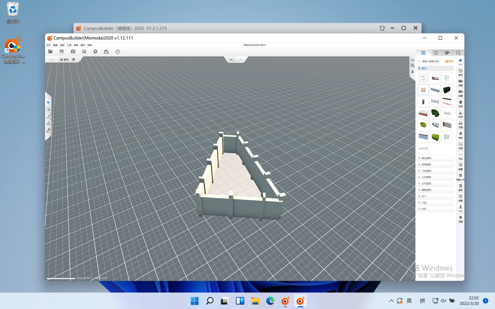
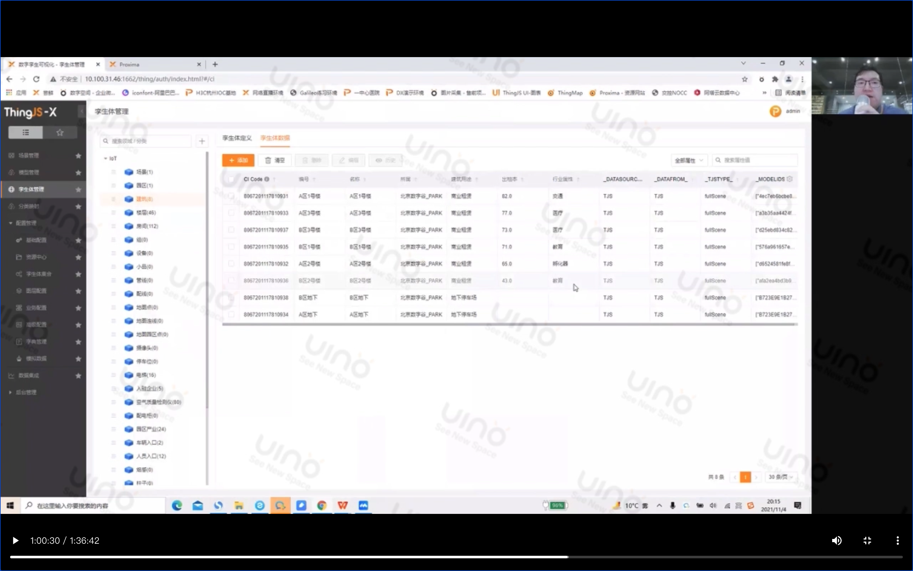
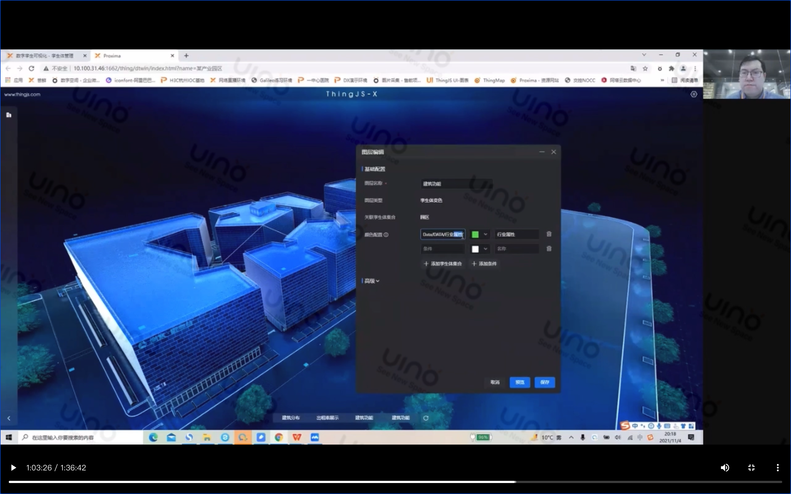

# 介绍

ThingJS是基于three.js的数字孪生平台，支持客户端（仅Windows）一键低代码完全省略建模的操作。

# 低代码

低代码就是很low的代码的意思，它可以通过客户端或者平台一键生成代码直接运行。

# CampusBuiler和CityBuilder

CampusBuiler和CityBuilder这两个针对三维园区以及三维城市地图的搭建工具。

CampusBuiler可以配合3DMax来使用，CityBuilder则可以将Geojson、GSV、Excel数据直接处理成建筑，并且能进行编辑修改功能。

# CampusBuilder客户端

可在客户端里直接手动建模，并提供丰富的模型，且支持导入导出功能。

> 注意：此客户端仅支持Windows，本截图在Mac端win11虚拟机下运行。

# 实战演示

网页开发者后台配置所有孪生体的各项参数

通过改软件（未介绍不知道叫什么）可以直接修改网页上的孪生体样式、位置、动画等参数。

该项目最终部署在tingjs云平台上或者下载离线包部署在本地